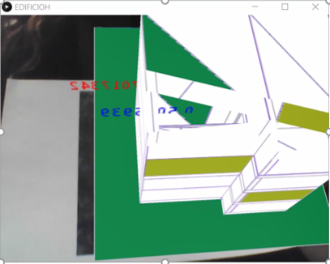

# Gestion de Proyecto para el Patrimonio Arquitectónico con Herramientas Tecnologías
## PatrimonioArq
Este repositorio forma parte de mis tesis de grado de Maestría en Arquitectura
 
En la Carpeta App Hibrida se muestra la propuesta de App Hibrida de la tesis
### Objetivos 
Demostrar la utilidad de una app movil con el uso de la herramienta de Realidad Aumentada para los Edificios Históricos
 

 
### Bibliografia Extendida
En el archivo Bibliografia Extendida se encuentran todas las referencias utilizadas en la tesis y para este repositorio.
